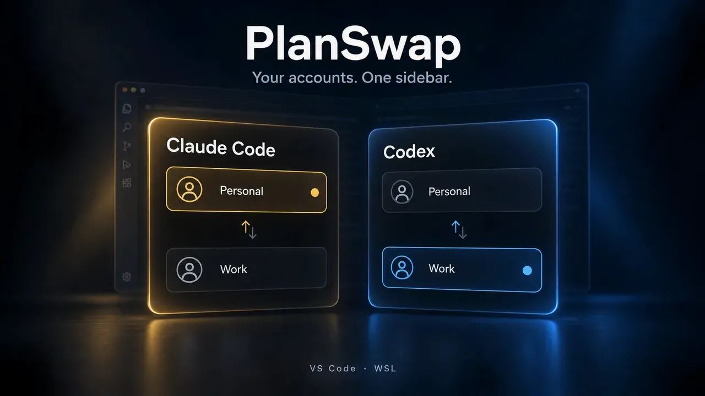

<p align="center">
  
</p>

# PlanSwap: Claude Code & Codex Account Switcher

Switch between the Claude Code and Codex subscription accounts you own (Claude Pro / Max, ChatGPT Plus / Pro…) from a VS Code sidebar, without signing out and back in. Built for VS Code WSL remote windows.

> **WSL/Linux only.** Native Windows and macOS are not supported.

[](https://code.visualstudio.com/)
[](#requirements)
[](https://github.com/n2ns/planswap/blob/main/package.json)
[](LICENSE)
[](https://github.com/n2ns/planswap/stargazers)
[](https://github.com/n2ns/planswap/commits/main)



## Features

- **One sidebar, two tabs**: Claude and Codex accounts side by side, with email and plan shown for every account.
- **One-click switching**: each account lives in its own config directory, so its sign-in, settings and history stay intact.
- **Shared global rules**: `CLAUDE.md` / `AGENTS.md` are symlinked from the default account, so there is only one copy to maintain.
- **Display names**: rename any account (only the label changes, never the directory).
- **Handy tools**: open the global rules file or extension settings, update either CLI in a terminal, show CLI and extension versions, reload the window, restart the extension host or the WSL server.
- **English and Simplified Chinese UI**, switchable in the settings.

## Requirements

- Antigravity IDE, VSCodium or VS Code, 1.107 or later, used through a **WSL remote window** (see [Supported editors](#supported-editors)). Native Windows and macOS are not supported.
- The official Claude Code and/or Codex extensions installed on the WSL side.
- For Codex switching: `bash` as the login shell.

## Supported editors

Claude switching only changes the Claude Code extension's setting, so it does not depend on the editor. Codex switching only takes effect after the editor's WSL server restarts, and whether PlanSwap can do that for you depends on the editor. PlanSwap recognizes the editor by its WSL server directory under `~`.

| Editor | WSL server directory | Claude switching | Codex switching |
| --- | --- | --- | --- |
| Antigravity IDE | `~/.antigravity-ide-server` (older releases: `~/.antigravity-server`) | ✅ | ✅ Server restarted automatically; click **Reload Window** in each WSL window |
| VSCodium | `~/.vscodium-server` | ✅ | ✅ Server restarted automatically; click **Reload Window** in each WSL window |
| VS Code | `~/.vscode-server` | ✅ | ⚠️ Manual: close all VS Code windows connected to the distro, wait a few seconds, then reopen them |

Only Antigravity IDE has been tested end to end. The VSCodium and VS Code rows follow from how their WSL servers are laid out and started, and have not been tested in those editors yet.

## Install

```bash
npm install
npm run package   # produces planswap-<version>.vsix
```

In a WSL window, run **Extensions: Install from VSIX...** and pick the generated file.

## Quick start

Open **AI Account Switcher** in the activity bar.

**Claude**

1. Type a name in **Add account** and press Enter. This creates `~/.claude-<name>`.
2. Click the row's **Log in** button, or switch to the account and sign in from the Claude Code panel.
3. Click the switch icon on any row. New sessions use that account; click **Reload Window** in the banner to move open panels over too.

**Codex**

1. On the Codex tab, click **Enable Codex switching**. After a confirmation, a small marker block is added to `~/.profile` and `~/.bashrc`.
2. Add an account and sign in the same way as for Claude.
3. Switch to it. Because Codex reads its account only at startup, the switch takes effect only after the editor's **WSL server restarts**. In Antigravity and VSCodium, PlanSwap restarts it for you: every WSL window disconnects and needs one **Reload Window** click, and integrated terminals close. In VS Code you close and reopen the windows yourself (see [Supported editors](#supported-editors)).

## Tools

Both tabs have an **Update CLI** button (**更新CLI** in Chinese) in the Tools row. Clicking it opens a terminal and runs:

| Tab | Command |
|---|---|
| Claude | `claude update` |
| Codex | `env -u CODEX_HOME codex update` |

Follow the update progress and any prompts in that terminal. The Codex command clears `CODEX_HOME` for the update process so a standalone installation under the default `~/.codex` can find its installation metadata after an account switch. It does not change the selected account or the editor's environment. Installations under a custom home may require their original installation method instead.

The shared footer provides version information, window reload, extension-host restart and WSL-server restart, followed by **User guide** (**使用说明**) and **Star**. These last two buttons open the [GitHub README](https://github.com/n2ns/planswap#readme) and [repository](https://github.com/n2ns/planswap), respectively; starring is done on GitHub. A separate small line below the buttons shows the installed PlanSwap version.

## Language

Set `aiSwitcher.language` to `auto` (default, follows VS Code), `en` or `zh-cn`. The panel, status bar and messages switch immediately. Command titles and the view name follow VS Code's display language (a VS Code limitation).

## Known limitations

- Sessions that are already open keep the old account until the window is reloaded.
- A switch applies to all WSL windows, not just the current one.
- Each account has its own settings, session history and workspace trust.
- Codex switching costs a WSL server restart and depends on the editor starting a new server after the old one exits. Automatic restart is available only in Antigravity and VSCodium (see [Supported editors](#supported-editors)).

## Privacy

Account management runs locally in your WSL environment. PlanSwap includes no telemetry or analytics and makes no network requests of its own.

- **Account information**: emails and subscription plans are read from local account files for display. Account names, directory paths, display names, ignored directories, and the selected sidebar tab are saved in VS Code's extension storage.
- **Claude credentials**: PlanSwap only checks whether `.credentials.json` exists; it never reads or copies its contents. Email and plan information come from `.claude.json`.
- **Codex credentials**: PlanSwap reads `auth.json` and decodes the ID token payload locally to display the email and plan. It does not verify the token signature or use it to authenticate. It never copies, swaps, or rewrites `auth.json`, and never logs, persistently stores, or sends raw tokens to the sidebar. API key mode displays only the label "API key".
- **Local changes**: account switching updates the Claude extension setting or the Codex selection file. Enabling Codex switching adds marker blocks to `~/.profile` and `~/.bashrc` after confirmation. New account directories can receive starter settings and links to shared global rules.
- **Data removal**: removing an account from the list does not delete its files unless you separately confirm directory deletion. That deletion permanently removes the directory's credentials, sessions, and other local data.

Sign-in, CLI updates and AI requests are handled by the official Claude Code and Codex clients, including when launched from PlanSwap. Those clients have their own network behavior and privacy policies; this statement covers PlanSwap itself. The User guide and Star buttons open GitHub in your browser.

## Uninstall

- **Claude**: remove the `CLAUDE_CONFIG_DIR` entry from `claudeCode.environmentVariables` in the WSL remote settings.
- **Codex**: run **Codex Account: Disable Codex Account Switching**, which removes the marker blocks and the state file.
- Account directories (`~/.claude-<name>`, `~/.codex-<name>`) are never deleted automatically.

## Documentation

- [Feature reference](docs/features.md): every button, command and rule in detail.
- [Claude design](docs/design.md) and [Codex design](docs/codex-design.md): how switching works and why.
- [AGENTS.md](AGENTS.md): development, tests (`npm test`) and contribution rules.
- [Blog post](https://n2ns.com/blog/switch-claude-code-codex-accounts-planswap): why PlanSwap exists and how it switches accounts without touching credentials.
- [Project page](https://n2ns.com/projects/planswap) on N2NS Lab.

## Disclaimer

PlanSwap is an independent community project and is not affiliated with, endorsed by, or sponsored by Anthropic or OpenAI.

## License

[MIT](LICENSE)
