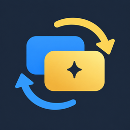

  

# PlanSwap: Claude Code & Codex Account Switcher

Switch between the Claude Code and Codex subscription accounts you own (Claude Pro / Max, ChatGPT Plus / Pro…) from a VS Code sidebar, without signing out and back in. Built for VS Code WSL remote windows.

> **WSL/Linux only.** Native Windows and macOS are not supported.

## Features

- **One sidebar, two tabs**: manage Claude and Codex accounts separately, with email and subscription plan shown when available.
- **Keep accounts signed in**: sign in once per account, then switch from the sidebar. Codex switches require a restart (see below).
- **Linked or independent accounts**: reuse the default account's setup, or keep separate settings and session histories.
- **Display names**: give named accounts labels that are easy to recognize.
- **Handy tools**: open your rules and settings, update the CLI, check installed versions and reload the editor.
- **English and Simplified Chinese UI**, switchable in the settings.

## Requirements

- Antigravity IDE, VSCodium or VS Code, 1.107 or later, used through a **WSL remote window** (see [Supported editors](#supported-editors)).
- The official Claude Code and/or Codex extensions installed on the WSL side.
- The corresponding CLI installed in WSL to use terminal sign-in and CLI tools.
- For Codex switching: `bash` as the login shell.

## Supported editors

For Claude, new sessions use the selected account; reload the window to update open panels. For Codex, follow the restart steps for your editor:

| Editor | After switching a Codex account |
| --- | --- |
| Antigravity IDE | After your confirmation, PlanSwap restarts the WSL server. Click **Reload Window** in each disconnected window. |
| VSCodium | After your confirmation, PlanSwap restarts the WSL server. Click **Reload Window** in each disconnected window. |
| VS Code | Close all VS Code windows connected to that WSL distribution, wait a few seconds, then reopen them. |

**Save your work before switching Codex accounts.** Restarting the WSL server disconnects its editor windows and closes integrated terminals and running CLI sessions. Reloading just one window does not replace this restart.

Only Antigravity IDE has been tested end to end. VSCodium and VS Code support has not yet been verified end to end in those editors.

## Install

Open the Extensions view in a **WSL window**, search for **PlanSwap** and click **Install** (the extension runs on the WSL side).

- VS Code: [Visual Studio Marketplace](https://marketplace.visualstudio.com/items?itemName=n2ns.planswap)
- Antigravity IDE, VSCodium: [Open VSX](https://open-vsx.org/extension/n2ns/planswap)

If you already have a `.vsix` file, run **Extensions: Install from VSIX...** in a WSL window and select it.

## Quick start

Open **PlanSwap** in the activity bar. The `default` row represents your existing default account. Use the Claude or Codex tab for the service you want to manage.

**Claude**

1. Type a name (letters, digits, `-` and `_`) in **Add account** and press Enter. Leave **Link to the default account's settings and history** checked to reuse your default setup, or uncheck it for separate settings and history.
2. Click the row's **Log in** button and complete sign-in in the terminal. You can also switch to the account and sign in from the Claude Code panel.
3. Click the switch icon on any row. New sessions use that account; click **Reload Window** in the banner to move open panels over too.

**Codex**

1. On the Codex tab, click **Enable Codex switching** and confirm the shell configuration changes shown by PlanSwap.
2. Add an account, choose linked or independent, then click **Log in** and complete sign-in in the terminal.
3. Click the switch icon and follow your editor's [restart steps](#supported-editors). Codex uses the selected account after the restart.

Use the pencil button to change a named account's display label. Use the refresh button at the top of the panel to rescan accounts and update their displayed information.

## Linked and independent accounts

Choose how each new account uses your default setup:

| | Linked | Independent |
| --- | --- | --- |
| Settings, rules and skills | Uses the default account's shared setup | Starts with a copy of the default configuration; later changes stay separate |
| History and sessions | Shares the default account's history and sessions | Keeps its own history and sessions |
| Sign-in | Separate for each account | Separate for each account |
| Best for | Accounts you use with the same setup | Accounts that need separate setups and histories |

Linked rows show a link badge. Codex memories remain separate, including for linked accounts. Sharing session files does not guarantee that another account can resume them; see [Known limitations](#known-limitations).

You can change an existing account's mode after switching away from it and closing its sessions:

- **Link to the default account** moves its settings and history into the shared setup. Conflicting files are kept for you to merge manually; review the result reported by PlanSwap.
- **Unlink from the default account** gives it a separate copy of the default configuration and keeps its sign-in. Shared history and sessions remain with the default account, so the unlinked account starts with an empty history.

Use **Re-link** in the Tools row to refresh shared settings and repair links. It only affects linked accounts on the selected tab.

## Tools

The Tools row and footer let you open rules and settings, check CLI and extension versions, reload the window, or restart the extension host or WSL server.

**Update CLI** opens a terminal for the selected service. Follow its progress and prompts there. If your CLI was installed in a custom location, you may need to update it using its original installation method.

**User guide** opens this README; **Star** opens the GitHub repository. The footer also shows your installed PlanSwap version.

## Language

In extension settings, set `planswap.language` to `auto` (follow your editor), `en` (English) or `zh-cn` (简体中文). The panel and messages update immediately; Command Palette titles and the sidebar name follow the editor's display language.

## Known limitations

- **Open sessions keep their current account.** Reload Claude panels after a switch; complete the WSL server restart for Codex.
- **Switching is not per window.** Other windows of the same editor connected to the same WSL environment are affected too.
- **Continuing another account's session can fail**, particularly between Codex accounts in different ChatGPT organizations. Avoid opening the same session from two accounts at once.
- **Some shared settings need a refresh.** After changing the default setup, use **Re-link**. If PlanSwap reports conflicting files, resolve them manually. Deleting Claude prompt history from a linked account does not necessarily remove it from the shared history.
- **MCP connections may need sign-in again for each account.** Claude MCP settings copied from the default account can include API keys stored in those settings; choose account setups accordingly.

## Privacy

Account management runs locally in your WSL environment. PlanSwap includes no telemetry or analytics and makes no network requests of its own.

- **Local storage**: account lists, display names and hidden-account records are saved in `~/.config/planswap/state.json` inside each WSL environment. The selected sidebar tab is saved in the editor's extension storage.
- **Account information**: email and plan details are read locally for display. PlanSwap never reads the contents of Claude's `.credentials.json`. It reads Codex's `auth.json` locally, but never copies, swaps or rewrites it, or sends raw tokens to the sidebar.
- **Configuration changes**: switching updates the settings that select an account. Enabling Codex switching adds configuration to `~/.profile` and `~/.bashrc` after confirmation. Linking accounts shares settings and history; it never links or copies their login credential files.
- **Deleting accounts**: removing a row does not delete its files unless you separately confirm directory deletion. Deleting the directory permanently removes that account's login and local data. Shared data in the default account is kept.

Sign-in, CLI updates and AI requests are handled by the official Claude Code and Codex clients, which have their own network behavior and privacy policies. User guide and Star links open GitHub in your browser.

## Uninstall

Before uninstalling PlanSwap:

1. Switch Claude back to `default` and reload the window.
2. If you enabled Codex switching, run **Codex Account: Disable Codex Account Switching** from the Command Palette to remove its shell configuration.
3. Uninstall PlanSwap from the Extensions view in your WSL window.

Your account directories (`~/.claude-<name>` and `~/.codex-<name>`) are kept. To clear PlanSwap's saved account list and display names as well, delete `~/.config/planswap/state.json`. This does not delete the accounts' own files.

## Documentation

- [Feature reference](docs/features.md): detailed instructions for managing accounts, switching and using panel tools.
- [Documentation map](docs/README.md): development, design, module contracts and verification guides.
- [Blog post](https://n2ns.com/blog/switch-claude-code-codex-accounts-planswap): why PlanSwap exists and how it switches accounts without copying or swapping credentials.

## Disclaimer

PlanSwap is an independent community project and is not affiliated with, endorsed by, or sponsored by Anthropic or OpenAI.

## License

[MIT](LICENSE)

Built by [N2NS Lab](https://n2ns.com/), the open-source lab of [datafrog.io](https://datafrog.io/) for practical AI developer tools.
